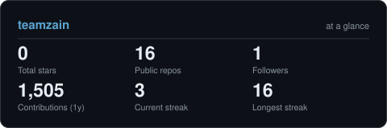
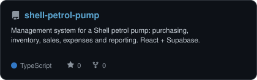
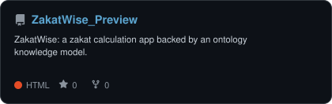
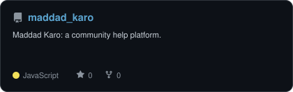
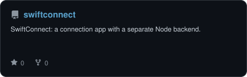

<!-- Portrait: drawn from my GitHub avatar by scripts/dotify.py, refreshed daily by .github/workflows/radar.yml -->

 

 

---

### About

I'm **Zain**, a full-stack developer and COO at **[Kinseb](https://kinsebmarketing.com)**, a web development, CRO and marketing agency working with clients across the US, UK and UAE. I split my time between shipping code and running the team that ships it.

- Building **web apps, SaaS products and Shopify stores** with React, Next.js, Node and Supabase
- Previously **Senior Full Stack Developer** at TechVision365
- Research background in **AI and graph embeddings**
- Based in **Sargodha, Pakistan**, working with clients worldwide

 

---

### Skills: how I rate myself vs. what my repos say

<table>
<tr>
<td width="50%" align="center" valign="middle">

<picture>
  <source media="(prefers-color-scheme: dark)"  srcset="assets/radar-dark.svg">
  <source media="(prefers-color-scheme: light)" srcset="assets/radar-light.svg">
  
</picture>

</td>
<td width="50%" align="center" valign="middle">

<picture>
  <source media="(prefers-color-scheme: dark)"  srcset="assets/radar-langs-dark.svg">
  <source media="(prefers-color-scheme: light)" srcset="assets/radar-langs-light.svg">
  
</picture>

</td>
</tr>
</table>

---

### Activity

<picture>
  <source media="(prefers-color-scheme: dark)"  srcset="https://raw.githubusercontent.com/teamzain/teamzain/output/snake-dark.svg">
  <source media="(prefers-color-scheme: light)" srcset="https://raw.githubusercontent.com/teamzain/teamzain/output/snake.svg">
  
</picture>

  

<picture>
  <source media="(prefers-color-scheme: dark)"  srcset="assets/card-stats-dark.svg">
  <source media="(prefers-color-scheme: light)" srcset="assets/card-stats-light.svg">
  
</picture>

---

### Selected work

<table>
<tr>
<td width="50%">
  <a href="https://github.com/teamzain/shell-petrol-pump">
    <picture>
      <source media="(prefers-color-scheme: dark)"  srcset="assets/card-shell-petrol-pump-dark.svg">
      <source media="(prefers-color-scheme: light)" srcset="assets/card-shell-petrol-pump-light.svg">
      
    </picture>
  </a>
</td>
<td width="50%">
  <a href="https://github.com/teamzain/ZakatWise_Preview">
    <picture>
      <source media="(prefers-color-scheme: dark)"  srcset="assets/card-ZakatWise_Preview-dark.svg">
      <source media="(prefers-color-scheme: light)" srcset="assets/card-ZakatWise_Preview-light.svg">
      
    </picture>
  </a>
</td>
</tr>
<tr>
<td width="50%">
  <a href="https://github.com/teamzain/maddad_karo">
    <picture>
      <source media="(prefers-color-scheme: dark)"  srcset="assets/card-maddad_karo-dark.svg">
      <source media="(prefers-color-scheme: light)" srcset="assets/card-maddad_karo-light.svg">
      
    </picture>
  </a>
</td>
<td width="50%">
  <a href="https://github.com/teamzain/swiftconnect">
    <picture>
      <source media="(prefers-color-scheme: dark)"  srcset="assets/card-swiftconnect-dark.svg">
      <source media="(prefers-color-scheme: light)" srcset="assets/card-swiftconnect-light.svg">
      
    </picture>
  </a>
</td>
</tr>
</table>

---

**Need a website, a Shopify store that converts, or a SaaS MVP?** 
<a href="https://kinsebmarketing.com">kinsebmarketing.com</a> · <a href="mailto:zain@kinsebmarketing.com">zain@kinsebmarketing.com</a>

Portrait, charts and cards regenerate themselves daily via GitHub Actions. Setup adapted from <a href="https://github.com/gargibhardwaj24">gargibhardwaj24</a>'s profile guide.

